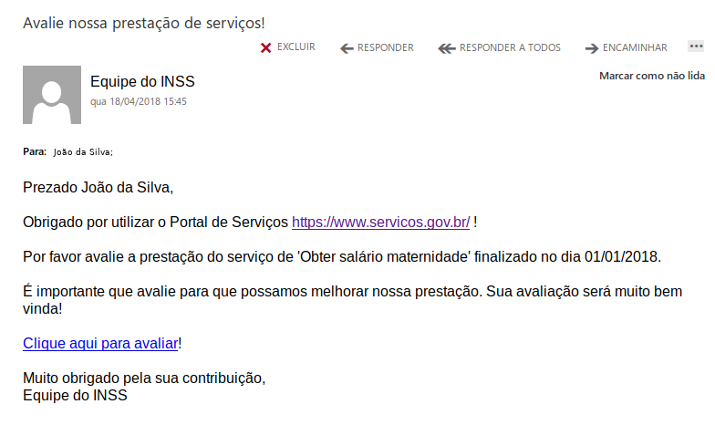
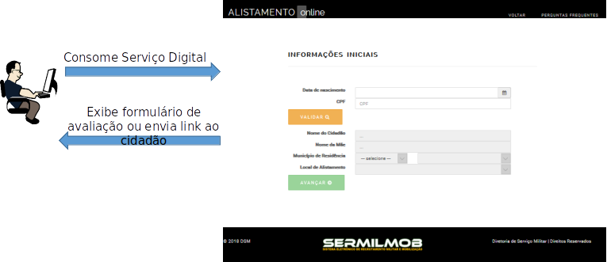
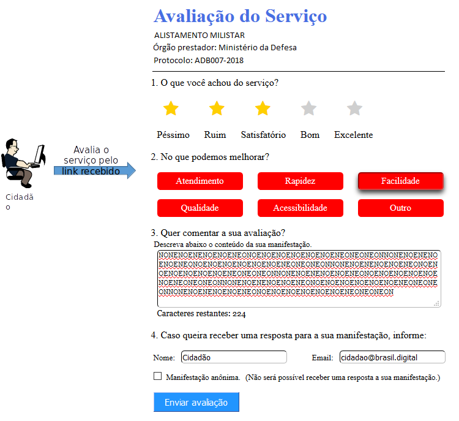

Apresentação
============

O decreto 8936/2016, instituiu a Plataforma de Cidadania Digital e dispôs sobre a oferta dos serviços públicos digitais, no âmbito dos órgãos e das entidades da administração pública federal direta, autárquica e fundacional.

No seu artigo 3º, incisos IV e V foi instituído a ferramenta de avaliação da satisfação dos usuários em relação aos serviços públicos prestados e o painel de monitoramento do desempenho dos serviços públicos prestados.

Entre as informações mínimas que deverão estar disponíveis no painel para cada serviço, órgão ou entidade da administração pública federal, estão o volume de solicitações, tempo médio de atendimento e o grau de satisfação dos usuários.

Este projeto foi criado para ajudar na coleta destas informações para a disponibilização delas no painel de monitoramento, e para ajudar aos órgãos e entidades da administração pública federal direta, autárquica e fundacional a atenderem disposto no decreto e com isso melhorarem a qualidade do serviço prestado ao cidadão.

Formas de uso
**************

É possível usar de duas formas:

* Enviar o link por email
* Adicionar o formulário na página

O cidadão ao final da execução do serviço pode receber o link da sua avaliação da prestaçao do serviço conforme figura abaixo.

   Exemplo de email recebido com link

.. attention::
    É **necessário que o próprio serviço** crie o texto e envie o email.

Ou pode-se incluir na página do serviço o formulário já pronto e fornecido pela API de avaliação conforme imagem abaixo.

.. figure:: _imagens/formulario.PNG
   :scale: 100 %
   :alt: Formulário de Avaliação de Serviços
   :align: center

   Formulário de Avaliação de Serviços

Fluxo simplificado para o cidadão
*********************************

O cidadão irá receber ou um email ou visualizar o formulário na própria página do serviço. A sugestão é a do envio do email para que o cidadão possa responder quando desejar.

   Cidadão recebe a solicitação de avaliação ao final do serviço prestado.

    Cidadão responde a avaliação.

Fluxo simplificado das APIs
****************************

.. image:: _imagens/fluxo_simplificado.svg
   :scale: 100 %
   :align: center
   :alt: Fluxo Simplificado do funcionamento das APIs.

.. important::
   Para que seja chamado a API de **Avaliação** é necessário o envio prévio de um **Acompanhamento**. Não há possibilidade de uma avaliação sem um acompanhamento associado.
