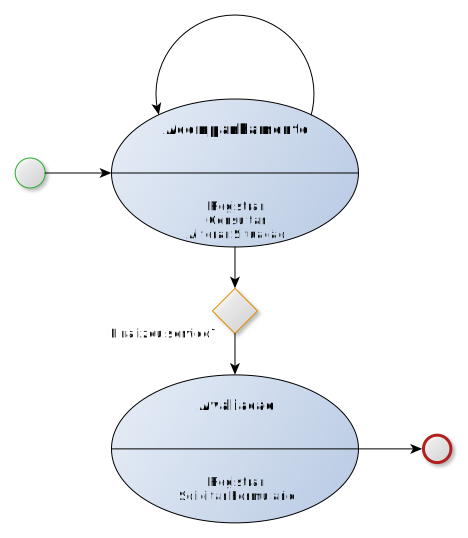

Apresentação
============

O decreto 8936/2016, instituiu a Plataforma de Cidadania Digital e dispôs sobre a oferta dos serviços públicos digitais, no âmbito dos órgãos e das entidades da administração pública federal direta, autárquica e fundacional.

No seu artigo 3º, incisos IV e V foi instituído a ferramenta de avaliação da satisfação dos usuários em relação aos serviços públicos prestados e o painel de monitoramento do desempenho dos serviços públicos prestados.

Entre as informações mínimas que deverão estar disponíveis no painel para cada serviço, órgão ou entidade da administração pública federal, estão o volume de solicitações, tempo médio de atendimento e o grau de satisfação dos usuários.

Este projeto foi criado para ajudar na coleta destas informações para a disponibilização delas no painel de monitoramento, e para ajudar aos órgãos e entidades da administração pública federal direta, autárquica e fundacional a atenderem disposto no decreto e com isso melhorarem a qualidade do serviço prestado ao cidadão.

Fluxo simplificado das APIs
****************************

.. important::
   Para que seja chamado a API de **Avaliação** é necessário o envio prévio de um **Acompanhamento**. Não há possibilidade de uma avaliação sem um acompanhamento associado.
