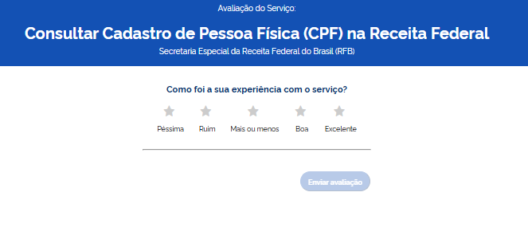
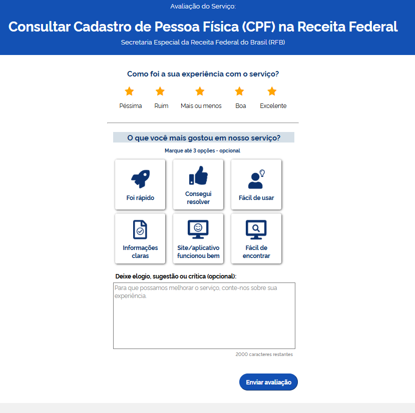
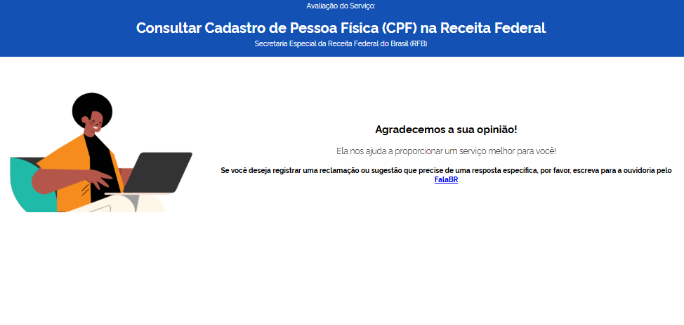

Apresentação
============

O decreto 8936/2016, instituiu a Plataforma de Cidadania Digital e dispôs sobre a oferta dos serviços públicos digitais, no âmbito dos órgãos e das entidades da administração pública federal direta, autárquica e fundacional.

No seu artigo 3º, incisos IV e V foi instituído a ferramenta de avaliação da satisfação dos usuários em relação aos serviços públicos prestados e o painel de monitoramento do desempenho dos serviços públicos prestados.

Entre as informações mínimas que deverão estar disponíveis no painel para cada serviço, órgão ou entidade da administração pública federal, estão o volume de solicitações, tempo médio de atendimento e o nível de satisfação dos usuários.

Fluxo simplificado para o cidadão
*********************************

O formulário de avaliação deverá ser exibido na própria página do serviço para melhor experiência do cidadão.

   Ao final da prestação do serviço o cidadão recebe o formulário de avaliação

    O cidadão poderá avaliar até 6 dimensões predeterminadas

    
    Após a avaliação, o cidadão será encaminhado para uma tela de sucesso

Fluxo simplificado das APIs
****************************

.. figure:: _imagens/novo_fluxo.png
   :scale: 100 %
   :align: center
   :alt: Fluxo Simplificado do funcionamento das APIs.

   Fluxo da API de avaliação

.. attention::
   - É obrigatório o registro de pelo menos uma etapa de acompanhamento para gerar uma avaliação. 

   - Cada etapa de acompanhamento poderá ser avaliada.

   - Fica a critério do órgão a forma de exibição do formulário de avaliação para o cidadão. Poderá ser um modal dentro da própria página do serviço/sistema (recomendado), pop-up ou email para o cidadão com o link de acesso ao formulário.
