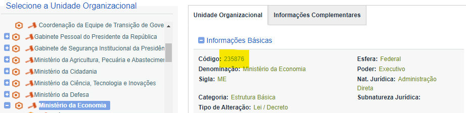
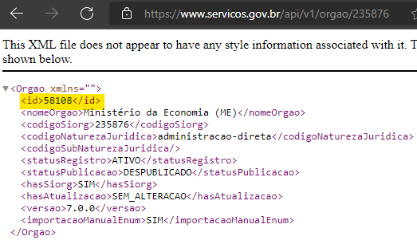
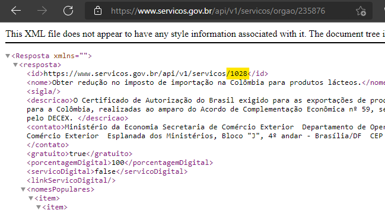

Passo a passo para avaliar um serviço
*************************************

1. Obtenha as credenciais para usar as APIs de avaliação
--------------------------------------------------------
Os métodos das APIs de avaliação necessitam de autenticação para uso (usuário e senha).

Para solicitar sua credencial, basta acessar a página temática https://www.gov.br/governodigital/pt-br/estrategias-e-governanca-digital/transformacao-digital/central-de-qualidade.

2. Descubra o código do órgão e o código dos seus serviços
----------------------------------------------------------
Para a correta utilização da API de Avaliação é preciso obter os códigos válidos do órgão e dos serviços na API de Serviços. 

Siga os seguintes passos:

**1- Descubra o ID do seu órgão no SIORG** https://siorg.gov.br/siorg-cidadao-webapp/resources/app/consulta-estrutura.html

   O código SIORG está destacado em amarelo

**2- Com o código SIORG obtido, descubra o código do órgão para ser utilizado na API de Avaliação.** Para isso, utilize o endereço https://servicos.gov.br/api/v1/orgao/ inserindo o código SIORG no final da URL.

Exemplo: https://servicos.gov.br/api/v1/orgao/235876

   O código do órgão está destacado na imagem acima. É esse código que deverá ser utilizado nas chamadas aos métodos da API de Avaliação. 

**3- Por último, descubra o código do seu serviço.** Utilize a URL https://servicos.gov.br/api/v1/servicos/orgao/ inserindo o código SIORG no final.

Exemplo: https://servicos.gov.br/api/v1/servicos/orgao/235876

   O código do serviço está destacado na imagem acima. É esse código que será usado nas chamadas aos métodos da API de avaliação

Essa chamada retorna todos os serviços cadastrados para órgão. Caso seu serviço não esteja listado (tanto em produção quanto em homologação), **procure o representante do seu órgão responsável pelo cadastro de serviços no Portal Gov.br**.

.. attention::
   O código do SIORG **não deverá ser utilizado** nas chamadas aos métodos da API de Avaliação.

.. important::
   Todos os passos desse tópico estão relacionados ao ambiente da API de Serviços de produção. Para ambiente de teste substitua **servicos.gov.br** por **h-api-servicos.estaleiro.serpro.gov.br**.

3. Envie o(s) acompanhamento(s) durante a execução do serviço
-------------------------------------------------------------

É obrigatório o registro de pelo menos uma etapa de acompanhamento para gerar uma avaliação. Cada etapa de acompanhamento poderá ser avaliada (esse procedimento é opcional).

**Como fazer:**
Para **Registrar Acompanhamentos** utilize o endpoint específico para isso. Acesse o manual em `Acompanhamento`_ para maiores informações.

4. Obter Link do formulário para avaliação
--------------------------------------------------------------
Fica a critério do órgão a forma de exibição do formulário de avaliação para o cidadão. Poderá ser um modal dentro da própria página do serviço/sistema (recomendado), pop-up ou email para o cidadão com o link de acesso ao formulário.
 
**Como fazer:**
Para **Obter Link do formulário de avaliação**, utilize o endpoint de avaliação.  Acesse o manual em `Avaliação`_ para maiores informações.

5. O cidadão preenche a avaliação
---------------------------------

O cidadão preenche o formulário de avaliação relacionado ao serviço prestado.

.. _`Acompanhamento`: acompanhamento.html
.. _`Avaliação`: avaliacao.html
.. _`Apresentação`: apresentacao.html#fluxo-simplificado-para-o-cidadao
.. _`siga o procedimento para obter as credenciais`: https://www.servicos.gov.br/pagina-tematica/outras-duvidas-editores
